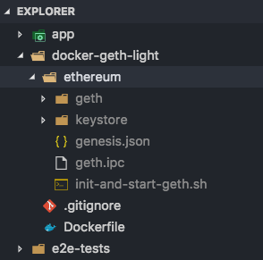

# EthExplorer (In Progress)


## License

GPL (see LICENSE)

## Installation

Install [Git](https://git-scm.com/book/en/v2/Getting-Started-Installing-Git "Git installation") if you haven't already

Clone the repo

`git clone https://github.com/etherparty/explorer`

Download [Nodejs and npm](https://docs.npmjs.com/getting-started/installing-node "Nodejs install") if you don't have them

Start the program. All dependencies will be automatically downloaded

`npm start`

Then visit http://localhost:8000 in your browser of choice. You might get an error message:

`geth --rpc --rpccorsdomain "http://localhost:8000"`

Install [geth](https://github.com/ethereum/go-ethereum/wiki/Building-Ethereum "Geth install") if you don't already have it, then run the above command.

Then refresh the page in your browser

## Docker (Explorer Only, Without Geth)

If you are using Docker, you can use this [Docker image from DockerHub](https://hub.docker.com/r/zulhfreelancer/ethereum_explorer/). See [Dockerfile](Dockerfile).

```
$ docker run --name block_explorer --rm -it -p 8000:8000 zulhfreelancer/ethereum_explorer:latest
```

## [BETA] Docker Compose (Explorer + Geth)

File structure:



Steps:

0) Clone this project into your dev machine, or into your cloud server where you want to host this explorer.

1) Update your network genesis inside `docker-geth/ethereum/genesis.json` file.

2) Put your private blockchain peer node address inside the `docker-geth/ethereum/static-nodes.json` file. See the correct structure [here](https://github.com/ethereum/go-ethereum/wiki/Connecting-to-the-network#static-nodes).

3) From the root folder of this project, run `sudo ./docker-compose-start.sh up --build`

The explorer should be up at [http://localhost:8002](http://localhost:8002) with a Geth instance automatically attached to it.

The Geth instance need some time to catch-up (download) all the blocks. Give it time to sync.

**Important**

The Geth instance exposes `8545` JSON RPC port. Even it has `--rpccorsdomain "http://localhost:8002"` argument defined, it's always a good idea to set the correct firewall settings to this `8545` port to prevent DDoS attack to your Geth instance.
